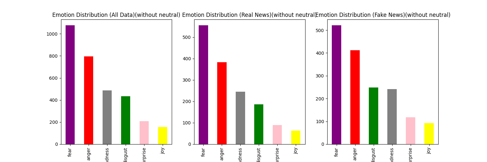

# Assignment 4  -  Using finetuned transformers via HugginFace

---
# Introduction and contents
This repository contains a Python script named "script.py" which peforms emotion classification on a text dataset using a HuggingFace model. This is done to analyse wheather or not there is an emotional differnce between face and real news.

## data
Same as assignment 2, the project makes use of the 10,556 news articles in the Fake News Dataset. Each article has a title, a body of content, and a label designating whether the news is true or false. The goal is to correctly identify each article's label based on the text it contains.

## models 

The model used for emotional classificaion is the "j-hartmann/emotion-english-distilroberta-base" transformer model from the platform hugginface which can be found here : https://huggingface.co/j-hartmann/emotion-english-distilroberta-base which predicts the 6 basic emotions. 

## script functions
The Python script follow a structured pipeline with the following steps:

1. Import the necessary libraries
2. Initializes the model 
3. Loads the dataset
4. Performs emotion classification on both real and fake news.
5. Plots the distribution and saves them to the "out" folder.

## how to replicate
### copy the repository 
git clone https://github.com/AU-CDS/assignment-4---using-finetuned-transformers-Olihaha

make sure to be in correct directory
(cd assignment-4)

### scripts
Run either setup.sh followed up by run.sh or setupandrun.sh

setup.sh activates a virtual environment, pip installs necessary libraries and deactives.

run.sh activates the virtual environment, runs the script and deactives itself again.

runandsetup.sh does both.

## results
Neutral came out as the most dominant emotion in both categories so i have chosen to generate both graphs without this emotion included as well, which can be found in the out folder.

### comparing real and fake emotions 

The emotions between both fake and real news are extremely similar. 

### takeaways
Initially I was expecting the fake news to be way more negative than its counterpart which most definitely is not the case. I assume that this is because the goal of fake news is to be so similar to real news that they cannot be told apart by the reader.
Based on the similarity this naturally also indicates that emotion is clearly not a good indication of real vs fake news. Especially considering that in assignment 2 we were able to predict fake vs real emotions with above 80% accuracy using other models.
